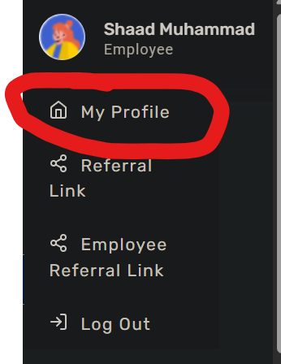
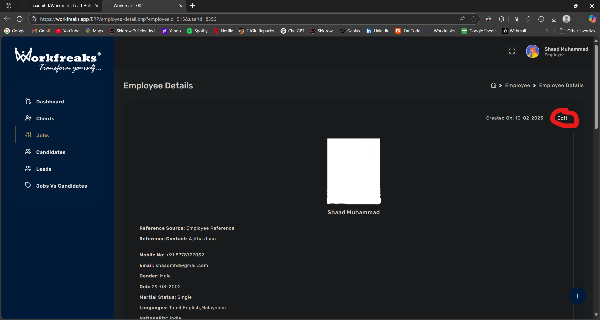

# Workfreaks ERP Lead Automation Tool

This tool automates the process of adding new leads to the Workfreaks ERP system directly from an Excel file.

**Important Security Note:** This script contains login credentials directly within its code. It is intended for internal team use only. **Do NOT share this code or repository outside of your authorized team.**

---

## 🚀 Getting Started (Initial Setup - One Time)

Follow these steps carefully to set up the automation tool on your computer. If you encounter any issues, please contact your secret bestie shaad(dont tell priya we are besties🤫🤫🤫).

### 1. Install Essential Software

You need to install the following software. Please follow the instructions and pay attention to important notes.

#### a. Install Python 3.x

Python is the programming language this tool is built with.

1.  Go to the official Python download page: [https://www.python.org/downloads/](https://www.python.org/downloads/)
2.  Download the **latest stable version of Python 3** (e.g., Python 3.10.x, 3.11.x, or 3.12.x). Choose the installer appropriate for your Windows system (e.g., "Windows installer (64-bit)").
3.  Run the downloaded installer (`.exe` file).
4.  **VERY IMPORTANT STEP:** On the first screen of the installer, make sure to **check the box that says "Add Python.exe to PATH"**. This is critical for the tool to work correctly.

5.  Click "Install Now" and follow the prompts to complete the installation.

#### b. Install Microsoft Edge Browser

This automation script requires the Microsoft Edge browser to function.

1.  Ensure Microsoft Edge is installed and up-to-date on your system.
2.  If you don't have it or need to update, download it from: [https://www.microsoft.com/en-us/edge/download](https://www.microsoft.com/en-us/edge/download)

#### c. Install Visual Studio Code (VS Code)

VS Code is a powerful and free code editor that makes it easy to run this automation tool.

1.  Go to the VS Code download page: [https://code.visualstudio.com/download](https://code.visualstudio.com/download)
2.  Download and install the "User Installer" version for Windows (64-bit recommended).
3.  Run the downloaded installer and follow the default installation prompts.

### 2. Set Up the Project in VS Code

Now, let's get the automation tool project ready within VS Code.

#### a. Download the Project Files

1.  Go to this GitHub repository page in your web browser: `[https://github.com/shaadmhd/Workfreaks-Lead-Automation]`
2.  Click the green **`< > Code`** button.
3.  Select **`Download ZIP`** and save the `Workfreaks-Lead-Automation-main.zip` file (or similar name) to a location on your computer where you want to keep the tool (e.g., your Desktop, Documents folder, or a dedicated "Automation Tools" folder).
4.  **Unzip** the downloaded file. This will create a folder like `Workfreaks-Lead-Automation-main`. You can rename this folder if you like (e.g., `Workfreaks Leads Tool`).

#### b. Open the Project in VS Code

1.  Open **Visual Studio Code**.
2.  Go to `File` > `Open Folder...` (or press `Ctrl+K Ctrl+O`).
3.  Navigate to the folder you just unzipped/renamed (e.g., `Workfreaks Leads Tool`).
4.  Click **"Select Folder"**.

#### c. Install VS Code Extensions

VS Code needs an extension to understand and run Python code.

1.  In VS Code, on the left sidebar, click the **Extensions** icon (it looks like four squares, one of them separated or press ctrl+shift+x).
2.  In the search bar, type `Python`.
3.  Look for the extension simply named **"Python"** published by **Microsoft**.
4.  Click the **"Install"** button next to it.
    * *(Screenshot example: Show VS Code extensions sidebar with Python extension highlighted and "Install" button)*

#### d. Install Required Python Libraries

The script uses several specialized Python libraries. You need to install them.

1.  In VS Code, go to `Terminal` > `New Terminal`. A terminal window will open at the bottom of VS Code.
2.  In the terminal, type the following command **exactly as shown** and press `Enter`:
    ```bash
    pip install -r requirements.txt
    ```
3.  Wait for the installation process to complete. You will see messages indicating that packages are being downloaded and installed. This might take a few minutes.
    * *(Screenshot example: Show the VS Code terminal with the pip install command and successful output)*

## 🚀 How to Use the Automation Tool

Once the initial setup is complete, you can follow these steps each time you want to add leads.

### 1. Prepare Your Leads Data in Excel

1.  Locate the `leads.xlsx` file inside your project folder (the one you opened in VS Code). (You can access it using vs code as well, but for that go again to the extension page on vs code and search for 'Excel'. Install it and then you'll be able to access it right from the vs code from the bar between this code and the extension side bar where you'll see the 'leads.xlsx' file. If this was successful then go to step 3, if not just follow step 2)
2.  **Open `leads.xlsx` with Microsoft Excel.**
3.  Fill in your lead data. Ensure you have the following columns with these exact names (case-sensitive):
    * `Name`
    * `Mobile Number`
    *(You can add other columns, but these two are mandatory for the script to work.)*
4.  **Important:** **Save and close the `leads.xlsx` file.** The script cannot run if the Excel file is open.

### 2. Add the other details you would want to add to your leads.

1.  In VS Code, in the left-hand Explorer panel, click on `automate_leads.py` to open the script in the editor.
2.  From line 20 to line 38 is the most important part of the automation where you'll need to make changes everyday to add in your leads(not necessasarily).
3.  As you can see, this part of the script has the necessary details of the form which needs to be filled here manually once, that it'll repeat the same datials again and again so that you dont have to☺️.
4.  Change the values as needed and make sure you dont make any changes any where else. Just change the values inside the "" and leave the rest as it is. If any personal changes required, then you know who's there to help you out with that😜.

**Important:** Before you try to automate it, make sure that when you log in to the workfreaks.app, you are in "edit employee" page. When you log in, if it is 'Job List' page then it won't work. You'll need to manually overide this step to automate the process. Go to line 145 for the steps to fix this.

### 3. Run the Automation Script

1.  There are multiple ways to run this file. Here are the two ways I would recommend. 

#### a. Clicking the file from the  folder.

1.  This is the simplest method. Basicialy after filling in all the necessary details into the script, close everything and then click on the file. This would automatically start to work and do its job. The con is that, you might not get to see the error, if something goes wrong. Which is why I would recommend the next step atleast for the first time. 
2.  The script will start running in the Command Prompt or Terminal. You will see progress messages like "Successfully logged in," "Processing Lead 1/X," etc.
3.  A new Microsoft Edge browser window will open and begin the automation process. **Do NOT interact with this browser window while the script is running.** Let it work automatically.
4.  

#### b. Open the Project in VS Code

1.  For this method, Open Command prompt on your PC and then type 'cd "the location of the code"'. For example if the code is in desktop then the location directory for my pc looks like 'C:\Users\shaad\OneDrive\Desktop'. Instead of 'shaad', it'll be your pc's username
2.  After that, type 'python "code file name"'. Here for instance its 'python automate_leads.py'. This will start running your script automatically.
3.  The script will start running in the Command Prompt or Terminal. You will see progress messages like "Successfully logged in," "Processing Lead 1/X," etc.
4.  A new Microsoft Edge browser window will open and begin the automation process. **Do NOT interact with this browser window while the script is running.** Let it work automatically.
5.  

### 3. Monitor Progress and Results

* Keep an eye on the output in the VS Code terminal. It will show you the status of each lead being processed (e.g., "Lead 'Sham' added successfully!").
* Once all leads are processed, the script will finish, and the browser will close automatically.

---

## ⚠️ Important Notes & Troubleshooting

* **Internet Connection:** An active internet connection is required for the script to access the Workfreaks ERP.
* **Browser Window:** A new Edge browser window will open automatically. Do not close it or interact with it while the script is running, as this will interrupt the automation.
* **Excel File Must Be Closed:** Always ensure the `leads.xlsx` file is closed before you run the script.
* **Errors / Script Stops:** If the script stops unexpectedly or you see "Error" or "Timeout" messages in the VS Code terminal:
    * Take a screenshot of the entire VS Code window (especially the terminal output).
    * Take a screenshot of the browser window (if it's still open).
    * Note down the exact error message if possible.
    * Contact Shaady with these details.
* **Antivirus/Firewall:** In some corporate environments, antivirus software or firewalls might interfere with the script's ability to control the browser. If you suspect this, you may need to consult with your IT department(duh).
* **Browser Updates:** If your Edge browser updates, `webdriver-manager` *should* automatically download the compatible driver. In rare cases, if the script fails after an Edge update, you might need to re-run the `pip install -r requirements.txt` command or ask for support. Probably won't.

If you see that your Workfreaks.app page logs in to the 'Job List' page instead of 'edit employee' page then all you got to do is,
1.  When you start the script, and when it automatically logs in and goes to 'JOB LIST' page, then click "My Profile" (check attached screenshot),
,  Click 'Edit'  . After this the script will continue as it would. 
---