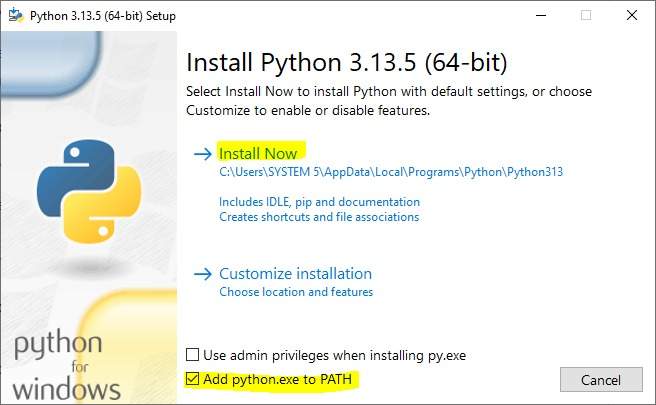
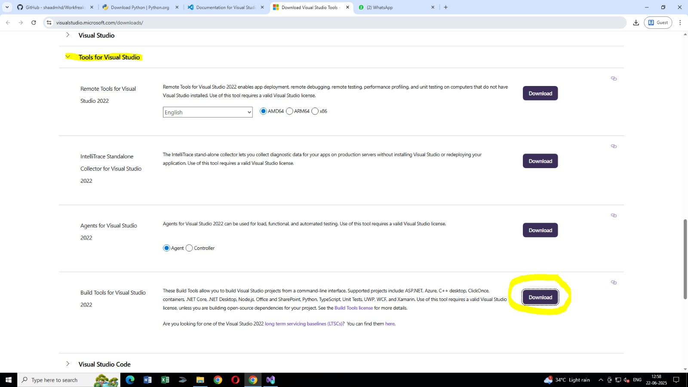

# Workfreaks Lead Automation Tool

This tool automates the process of adding new leads to the Workfreaks ERP system directly from an Excel file.

**Important Security Note:** This script contains login credentials directly within its code. It is intended for internal team use only. **Do NOT share this code or repository outside of your authorized team.**

---

## 👻 Getting Started (Initial Setup - One Time)

Follow these steps carefully to set up the automation tool on your computer. If you encounter any issues, please contact your secret bestie shaad (don't tell priya we are besties🤫🤫🤫).

### 1. Install Essential Software

You need to install the following software. Please follow the instructions and pay attention to important notes.

#### a. Install Python 3.x

Python is the programming language this tool is built with.

1.  Go to the official Python download page: [https://www.python.org/downloads/](https://www.python.org/downloads/)
2.  Download the **latest stable version of Python 3** (e.g., Python 3.10.x, 3.11.x, or 3.12.x). Choose the installer appropriate for your Windows system (e.g., "Windows installer (64-bit)").

3.  Run the downloaded installer (`.exe` file).
4.  **VERY IMPORTANT STEP:** On the first screen of the installer, make sure to **check the box that says "Add Python.exe to PATH"**. This is critical for the tool to work correctly.
 
5.  Click "Install Now" and follow the prompts to complete the installation.

#### b. Install Microsoft Edge Browser

This automation script requires the Microsoft Edge browser to function.

1.  Ensure Microsoft Edge is installed and up-to-date on your system.
2.  If you don't have it or need to update, download it from: [https://www.microsoft.com/en-us/edge/download](https://www.microsoft.com/en-us/edge/download)

#### c. Install Visual Studio Code (VS Code)

VS Code is a powerful and free code editor that makes it easy to run this automation tool.

1.  Go to the VS Code download page: [https://code.visualstudio.com/download](https://code.visualstudio.com/download)
2.  Download and install the "User Installer" version for Windows (64-bit recommended).
3.  Run the downloaded installer and follow the default installation prompts.

#### d. Install Microsoft Visual C++ Build Tools (CRITICAL for Dependencies like NumPy/Pandas)

Some Python libraries, like NumPy and Pandas (which this script uses), require underlying C/C++ components to be compiled during installation. This requires specific build tools from Microsoft. **If you skip this step, the script will not install correctly!**

1.  **Download Visual Studio Build Tools:**
    * Go to the official Microsoft Visual Studio downloads page: [https://visualstudio.microsoft.com/downloads/](https://visualstudio.microsoft.com/downloads/)
    
    * Scroll down to the **"Tools for Visual Studio"** section.
    * Find **"Build Tools for Visual Studio"** and click the **"Download"** button.

2.  **Run the Installer (`vs_buildtools.exe`):**
    * Once downloaded, run the `vs_buildtools.exe` file.
    * This will open the Visual Studio Installer.

3.  **Select Workloads (IMPORTANT):**
    * In the Visual Studio Installer, you will see a list of "Workloads."
    
    * **Crucially, check the box for "Desktop development with C++"**. This is the primary workload that includes the necessary C++ compilers and build tools.
    
4.  **Install:**
    * Click the **"Install"** button in the bottom right corner.
    * This installation can be large (several gigabytes) and may take some time.

5.  **Restart PC (Highly Recommended):** After the installation of the build tools completes, it's highly recommended to **restart your PC**. This ensures that all necessary environment variables are correctly updated.

---

### 2. Set Up the Project in VS Code

Now, let's get the automation tool project ready within VS Code.

#### a. Download the Project Files

1.  Go to this GitHub repository page in your web browser: [https://github.com/shaadmhd/Workfreaks-Lead-Automation]
2.  Click the green **`< > Code`** button.
3.  Select **`Download ZIP`** and save the `Workfreaks-Lead-Automation-main.zip` file (or similar name) to a location on your computer where you want to keep the tool (e.g., your Desktop, Documents folder, or a dedicated "Automation Tools" folder).
4.  **Unzip** the downloaded file. This will create a folder like `Workfreaks-Lead-Automation-main`. You can rename this folder if you like (e.g., `Workfreaks Leads Tool`).

#### b. Open the Project in VS Code

1.  Open **Visual Studio Code**.
2.  Go to `File` > `Open Folder...` (or press `Ctrl+K Ctrl+O`).
3.  Navigate to the folder you just unzipped/renamed (e.g., `Workfreaks Leads Tool`).
4.  Click **"Select Folder"**.

#### c. Install VS Code Extensions

VS Code needs an extension to understand and run Python code.

1.  In VS Code, on the left sidebar, click the **Extensions** icon (it looks like four squares, one of them separated, or press `Ctrl+Shift+X`).
2.  In the search bar, type `Python`.
3.  Look for the extension simply named **"Python"** published by **Microsoft**.
4.  Click the **"Install"** button next to it.

#### d. Install Required Python Libraries

The script uses several specialized Python libraries. You need to install them.

1.  In VS Code, go to `Terminal` > `New Terminal`. A terminal window will open at the bottom of VS Code.
2.  In the terminal, ensure you are in your project folder (the path in the terminal should end with `\Workfreaks-Lead-Automation-main>` or your renamed folder name).
3.  Type the following command **exactly as shown** and press `Enter`:
    ```bash
    pip install -r requirements.txt
    ```
4.  Wait for the installation process to complete. You will see messages indicating that packages are being downloaded and installed. This might take a few minutes. If you see any errors here, **STOP** and contact Shaad immediately.

---

## 😈 How to Use the Automation Tool

Once the initial setup is complete, you can follow these steps each time you want to add leads.

### 1. Prepare Your Leads Data in Excel

1.  Locate the `leads.xlsx` file inside your project folder (the one you opened in VS Code).
2.  **Open `leads.xlsx` with Microsoft Excel.**
3.  Fill in your lead data. Ensure you have the following columns with these exact names (case-sensitive):
    * `Name`
    * `Mobile Number`
    *(You can add other columns, but these two are mandatory for the script to work.)*
4.  **Important:** **Save and close the `leads.xlsx` file.** The script cannot run if the Excel file is open.

### 2. Configure Default Lead Details (Optional - If you want to change default form values)

This section allows you to customize the default values that the script fills into the "Add Lead" form.

1.  In VS Code, in the left-hand Explorer panel, click on `automate_leads.py` to open the script in the editor.
2.  Scroll down to the section that defines `DEFAULT_COUNTRY_CODE`, `DEFAULT_LEAD_TYPE`, etc. (roughly from line 20 to line 38, but check your script for exact lines).
    ```python
    # Example snippet:
    DEFAULT_COUNTRY_CODE = "India (91)"
    DEFAULT_LEAD_TYPE = "Job Seeker"
    # ... and so on for other default values
    ```
3.  Change the values inside the double-quotes (`""`) as needed. **Do not modify anything else in this section or elsewhere in the code.** For example, to change the default lead type to "Candidate", you would change `DEFAULT_LEAD_TYPE = "Job Seeker"` to `DEFAULT_LEAD_TYPE = "Candidate"`.
4.  **Save the `automate_leads.py` file** after making any changes (`File > Save` or `Ctrl+S`).

### 3. Run the Automation Script (Recommended Method)

This is the most reliable way to run the script and see any potential errors.

1.  In VS Code, ensure `automate_leads.py` is open in the editor.
2.  Look for the **"Run Python File"** button in the **top-right corner of VS Code**. It typically looks like a green play arrow (▶️).
3.  **Click this button.**
    * Alternatively, you can go to the `Run` menu at the top, and select `Run Without Debugging` (or press `Ctrl + F5`).
4.  The script will start running in the integrated terminal at the bottom of VS Code. You will see progress messages like "Successfully logged in," "Processing Lead 1/X," etc.
5.  A new Microsoft Edge browser window will open and begin the automation process. **Do NOT interact with this browser window while the script is running.** Let it work automatically.

### 4. Monitor Progress and Results

* Keep an eye on the output in the VS Code terminal. It will show you the status of each lead being processed (e.g., "Lead 'Sham' added successfully!").
* Once all leads are processed, the script will finish, and the browser will close automatically.

---

## ⚠️ Important Notes & Troubleshooting

* **Internet Connection:** An active internet connection is required for the script to access the Workfreaks ERP.
* **Browser Window:** A new Edge browser window will open automatically. Do not close it or interact with it while the script is running, as this will interrupt the automation.
* **Excel File Must Be Closed:** Always ensure the `leads.xlsx` file is closed before you run the script.
* **Errors / Script Stops:** If the script stops unexpectedly or you see "Error" or "Timeout" messages in the VS Code terminal:
    * Take a screenshot of the entire VS Code window (especially the terminal output).
    * Take a screenshot of the browser window (if it's still open).
    * Note down the exact error message if possible.
    * Contact Shaady with these details.
* **Antivirus/Firewall:** In some corporate environments, antivirus software or firewalls might interfere with the script's ability to control the browser. If you suspect this, you may need to consult with your IT department (duh).
* **Browser Updates:** If your Edge browser updates, `webdriver-manager` *should* automatically download the compatible driver. In rare cases, if the script fails after an Edge update, you might need to re-run the `pip install -r requirements.txt` command or ask for support. Probably won't.
* **Login Page Issue (Job List vs. Edit Employee):**
    If you see that your `workfreaks.app` page logs in to the 'Job List' page instead of the 'Edit Employee' page, the script might encounter issues.
    * When the script logs in and automatically goes to the 'Job List' page, you'll need to manually intervene *just this once*:
        * Click on **"My Profile"** (check attached screenshot if available).
        * Then click **"Edit"**.
    * After this manual step, the script should be able to continue the automation process as expected. This might be a temporary workaround if the initial landing page is inconsistent.

---
